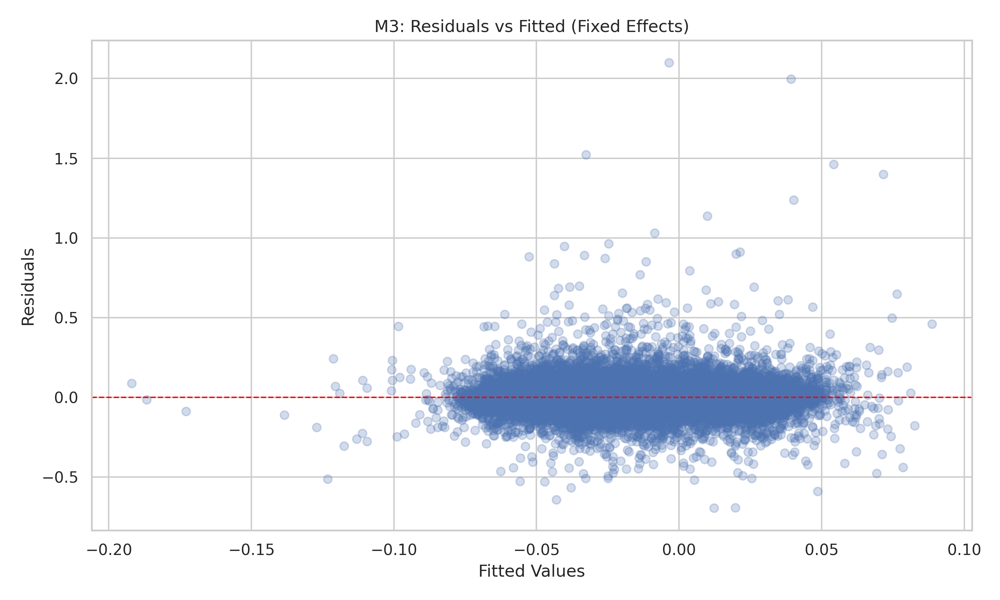
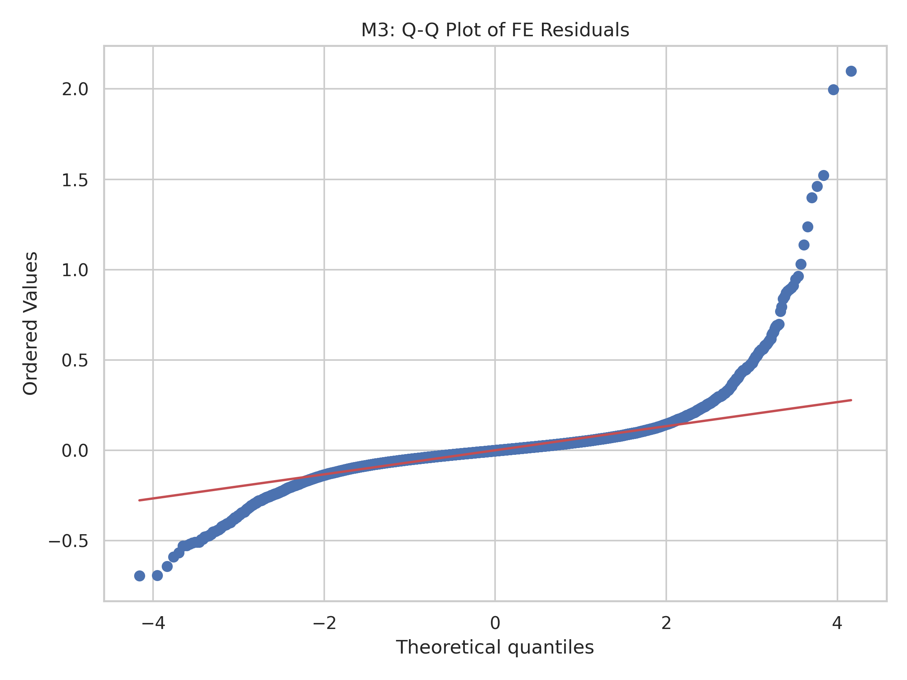
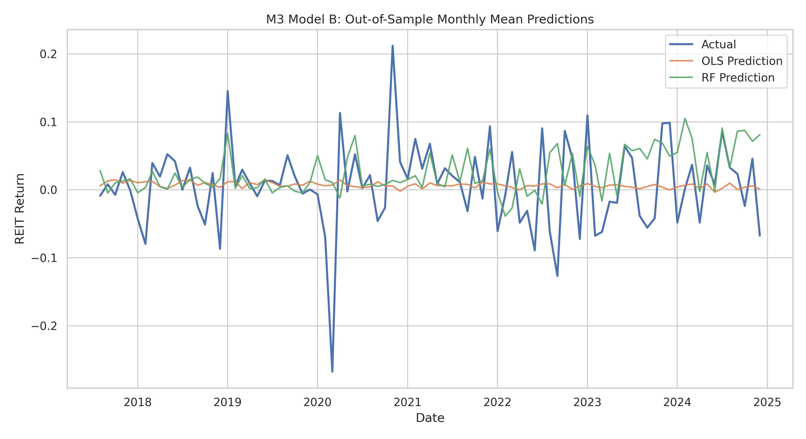
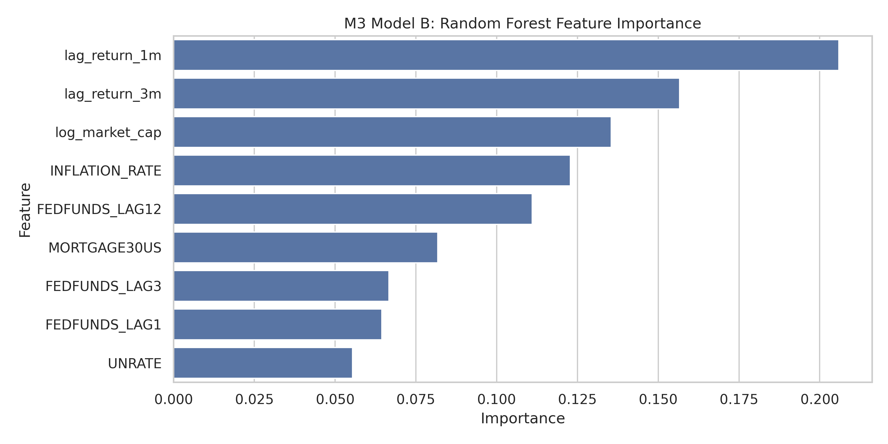

# Memorandum

**TO:** Investment Committee  
**FROM:** Josh Love, Brody Duffel, Tallulah Pascucci  
**DATE:** May 1, 2026  
**RE:** REIT Return Sensitivity to Interest Rate Policy - Investment Strategy Recommendation

## Executive Summary

We analyzed 367 REITs over 47,695 monthly observations from December 1986 through December 2024 to understand how monetary policy affects REIT returns. In our primary two-way fixed-effects model, a 1 percentage point increase in the Federal Funds Rate lagged 12 months is associated with a 1.34 percentage point decline in monthly REIT returns in the point estimate. However, once we use entity-clustered standard errors, the effect is not statistically distinguishable from zero at conventional levels (p = 0.241). In plain language, the direction of the relationship is consistent with economic theory, but the estimate is not precise enough to support aggressive tactical timing by itself.

The broader evidence points in the same direction but does not materially strengthen the case for a strong allocation shift. The sign on the rate variable remains negative in the robustness checks, but the magnitude weakens when crisis periods are excluded and the model fit remains low. Our alternative model comparison also does not justify a more complex forecasting rule: ordinary least squares outperforms Random Forest out of sample, which suggests the data do not reward added complexity here. Because the current panel is effectively sector-homogeneous, we emphasize balance-sheet strength and size rather than sector rotation.

Given the current rate environment, we recommend a neutral aggregate REIT stance with a modest defensive tilt toward larger-cap, lower-leverage names. We would not make large portfolio changes solely on the basis of short-run Fed moves. If policy rates rise another 100 basis points, the point estimate implies roughly a 1.3 percentage point monthly drag after the lag, but we treat that as a stress scenario rather than a dependable forecast because the clustered estimate is imprecise and the model has limited explanatory power.

## Methodology

### Data Sources

Our primary dataset is the CRSP/Ziman REIT Master panel provided through the course repository. The final analysis panel contains 367 unique REITs, 47,695 monthly observations, and coverage from 1986-12 to 2024-12. The outcome variable is monthly REIT return (`usdret`), and the main entity identifier is `permno`. Core REIT characteristics include market capitalization, book value, leverage-related measures, and return persistence controls.

We merged the REIT panel with monthly macroeconomic series from FRED, including the Federal Funds Rate (`FEDFUNDS`), 30-Year Mortgage Rate (`MORTGAGE30US`), Consumer Price Index (`CPIAUCSL`), and Unemployment Rate (`UNRATE`). The data dictionary in the repository documents the full variable set and confirms that the panel is unbalanced, which is expected because REITs enter and exit the sample over time.

### Sample Construction

We removed observations with missing returns and constructed lagged variables at the REIT-month level. The final estimation sample for the fixed-effects model contains 43,405 observations after complete-case filtering on the main regressors. We retained the unbalanced panel rather than forcing a balanced sample because fixed-effects estimators can accommodate varying entity histories without discarding most of the data.

### Model A: Two-Way Fixed Effects

Our primary specification is a two-way fixed-effects panel regression with entity and time effects:

$$
USDRET_{it} = \beta_0 + \beta_1 FEDFUNDS\_LAG12_{it} + \beta_2 lag\_return\_1m_{it} + \beta_3 log\_market\_cap_{it} + \beta_4 UNRATE_t + \alpha_i + \delta_t + \varepsilon_{it}
$$

where $\alpha_i$ controls for time-invariant REIT characteristics, $\delta_t$ controls for month-specific shocks affecting all REITs, and standard errors are clustered by REIT. We use a 12-month lag on the policy rate because the M2 evidence suggested delayed transmission and the REIT financing and valuation channels typically operate with a lag.

### Model B: Predictive Comparison

To test whether a more flexible non-linear model improves prediction, we compared an OLS benchmark with Random Forest using lagged rate variables, mortgage rates, inflation, return persistence, and size controls. The purpose of Model B is not causal identification; it is a check on whether the data support more complex forecasting behavior than a linear model.

## Results

### Table 1. Fixed Effects Regression Results

| Variable | Coefficient | Std. Error | p-value |
|---|---:|---:|---:|
| FEDFUNDS_LAG12 | -0.0134 | 0.0115 | 0.2414 |
| lag_return_1m | -0.0837 | 0.0109 | < 0.001 |
| log_market_cap | 0.0049 | 0.0011 | < 0.001 |

**Model statistics:** Entity fixed effects = Yes; Time fixed effects = Yes; Clustered standard errors = Yes; N = 43,405; Within $R^2$ = -0.0399.

The main rate coefficient is negative, which is directionally consistent with the leverage, discount-rate, and demand channels discussed in the earlier milestones. Economically, the estimate implies that a 1 percentage point increase in the Federal Funds Rate is associated with about a 1.34 percentage point lower monthly REIT return after a 12-month lag. Statistically, however, the clustered standard error is large enough that we cannot reject the null of no effect. That means the memo should not frame the result as a precise trading signal.

The strongest and most stable control is return persistence: the one-month lagged return is negative and highly significant in this specification, which suggests short-run mean reversion or other autocorrelation effects in monthly REIT returns. Log market cap is also positive and significant, indicating that larger REITs tend to outperform smaller names after accounting for fixed effects and the macro controls in the model.

### Table 2. Predictive Comparison

| Model | Test $R^2$ | Test RMSE |
|---|---:|---:|
| OLS | 0.0032 | 0.1029 |
| Random Forest | -0.0788 | 0.1070 |

The predictive comparison does not favor a more complex model. Random Forest performs worse than OLS on both test fit and error, which tells us that the return process in this sample is not being captured better by a non-linear black-box approach. In practical terms, that supports keeping the interpretation centered on the fixed-effects regression rather than relying on machine-learning forecast output for the investment recommendation.

### Visual Evidence

*Figure 1. Residuals vs. fitted values from the fixed-effects model. The scatter does not reveal a strong pattern, but the heteroskedasticity test justifies clustered inference.*

*Figure 2. Q-Q plot of fixed-effects residuals. The tails are not perfectly normal, which is common in return data and is another reason to rely on robust inference.*

*Figure 3. Actual versus predicted values for the OLS and Random Forest models. The OLS benchmark is at least as useful as the more flexible alternative.*

*Figure 4. Random Forest feature importance. Short-run return persistence and size matter more than any single macro variable, but predictive power remains weak overall.*

### Diagnostics and Robustness

The Breusch-Pagan test strongly rejects homoskedasticity in the pooled OLS diagnostic proxy (LM p-value approximately 5.0e-126), so clustered standard errors are the correct inferential choice for the panel model. The maximum VIF is 8.40 for `UNRATE`, which confirms that the macro variables are somewhat collinear and should not be overloaded in the same specification.

Robustness checks point in the same broad direction but also reinforce caution. The policy-rate coefficient remains negative when crisis periods are excluded, but the magnitude weakens and statistical significance remains absent under clustered inference. Alternative lag structures were also tested, and no lag produced a convincingly stable, highly significant coefficient once the fixed-effects and clustering framework was imposed. The main message is therefore stability of sign, not stability of precision.

## Conclusions & Recommendations

The empirical evidence supports a cautious REIT posture rather than a strong directional call. We recommend maintaining a neutral aggregate allocation to the REIT sleeve and tilting modestly toward larger-cap, lower-leverage names that are better positioned to absorb rate volatility. That recommendation is based less on a sharply estimated policy-rate coefficient and more on the fact that the model does not show enough precision to justify an aggressive overweight or underweight decision.

If the Federal Reserve keeps policy rates elevated, the sector-level implication is not panic but patience: REITs with stronger balance sheets should be favored, while highly levered names deserve closer scrutiny because refinancing costs and discount-rate pressure are still the dominant transmission channels. If policy rates fall by about 100 basis points over the next year, the point estimate suggests a modest return tailwind for the REIT sleeve, but the model uncertainty is too large to treat that as a forecast rather than a scenario.

Our risk assessment is straightforward. First, the fixed-effects design assumes that unobserved REIT characteristics are time-invariant, which may not hold if portfolios or leverage structures change materially. Second, omitted variables such as liquidity shocks, investor sentiment, or property-specific fundamentals could still confound the estimated rate effect. Third, the current panel offers limited sector heterogeneity, so recommendations should be framed around balance-sheet quality and size rather than fine sector rotation. These limits do not invalidate the analysis, but they do bound how aggressively the findings should be used.

### Scenario Analysis

| Scenario | Fed Funds Path | Expected REIT Impact | Recommendation |
|---|---|---:|---|
| Baseline | Rates hold near current levels | Flat to slightly negative | Neutral stance |
| Dovish | Rates fall 100 bp | Modest recovery after lag | Add selectively to quality names |
| Hawkish | Rates rise 50-100 bp | Near-term drag on returns | Underweight leveraged names |

Because the model is only modestly informative, the right operating stance is selective defense rather than broad de-risking. In a higher-rate environment, the best use of this analysis is to screen for balance-sheet resilience rather than to time the entire REIT market.

## References

1. CRSP/Ziman Real Estate Database. (2024). REIT master panel provided through the course repository.
2. Federal Reserve Bank of St. Louis. (2024). Federal Reserve Economic Data (FRED): `FEDFUNDS`, `MORTGAGE30US`, `CPIAUCSL`, `UNRATE`.
3. Wooldridge, J. M. (2010). *Econometric Analysis of Cross Section and Panel Data*. MIT Press.
4. Repository data dictionary and project files: `data/final/data_dictionary.md`, `results/tables/M3_regression_table.csv`, `results/tables/M3_modelB_ml_metrics.csv`.

## Appendix: AI Audit Summary

We used AI as a productivity tool across the capstone, but every important result was verified by the team against the repository outputs.

- **M1 Data pipeline:** GitHub Copilot helped scaffold the REIT and FRED ingestion scripts and the merge workflow. We verified row counts, date parsing, merge integrity, and output paths before trusting any generated code.
- **M2 EDA:** AI helped generate notebook structure, plots, and captions. We checked that every figure executed cleanly and that the lag story matched the observed correlations rather than generic template language.
- **M3 econometric models:** AI helped draft the fixed-effects script, diagnostics, and robustness checks. We validated the model specification, clustered standard errors, Breusch-Pagan test, VIF table, and holdout comparison before using the outputs in interpretation.
- **M4 memo writing:** AI assisted with framing and drafting prose, but we manually corrected units, softened claims that were too strong, and aligned the recommendation with the actual clustered inference and weak out-of-sample results.

**Verification and critique examples:**

- We corrected AI’s tendency to blur percentage points and percent when interpreting the Fed Funds coefficient.
- We rejected any wording that implied a statistically precise trading signal because the clustered estimate is not significant.
- We kept the recommendation modest because the model fit is weak and the Random Forest benchmark does not improve predictive performance.

**Responsibility statement:** All code, tables, and interpretations in this memo were checked by the team. We used AI to speed up drafting and formatting, not as a substitute for economic reasoning or validation.
