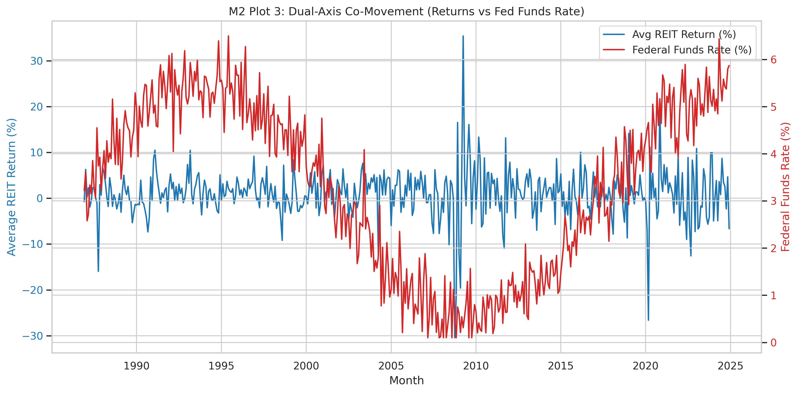

# REIT Return Sensitivity to Interest Rate Policy
## Final Investment Memo Presentation

**Team:** Josh Love, Brody Duffel, Tallulah Pascucci  
**Date:** May 1, 2026

---

## What We Studied

- We looked at **367 REITs** from **1986 to 2024**.
- We asked a simple question: **Do higher interest rates hurt REIT returns?**
- We used the **Federal Funds Rate** as the main driver and monthly REIT returns as the outcome.
- We also checked whether a more complex model helped with prediction.

---

## Main Result

### Higher rates are linked to lower REIT returns, but the estimate is not very precise.

- A **1 percentage point** increase in the Federal Funds Rate, with a **12-month lag**, is linked to about a **1.34 percentage point drop** in monthly REIT returns.
- But when we use the more reliable clustered standard errors, the result is **not statistically strong enough** to call it a firm effect.
- So the safe message is: **the direction makes sense, but we should not overstate it**.

---

## Why This Makes Sense

- **Leverage channel:** higher rates raise borrowing costs.
- **Discount-rate channel:** higher rates reduce the present value of future cash flows.
- **Demand channel:** tighter policy can slow the property market.

---

## Did the Model Hold Up?

- We checked for **heteroskedasticity** and found enough of it to justify clustered standard errors.
- We checked **multicollinearity** and found the macro variables are somewhat related, so we kept the model simple.
- We ran **robustness checks** using different lags and excluding crisis periods.
- The main message stayed the same: **negative sign, weak precision**.

---

## Prediction Check

- We compared **OLS** with **Random Forest**.
- OLS did **better** out of sample.
- Random Forest did **not** improve prediction, so a more complex model did not add value here.
- That means the simple regression is still the better story for this project.

---

## Recommendation

### What should investors do?

- Keep a **neutral** overall REIT stance.
- Tilt slightly toward **larger-cap, lower-leverage** REITs.
- Avoid making big moves based only on short-term Fed changes.
- If rates fall, REITs could recover somewhat, but we would treat that as a **scenario**, not a sure forecast.

---

## Risks and Close

- Our model cannot prove cause and effect perfectly.
- Other things like sentiment, liquidity, and property-specific shocks may also matter.
- The panel has limited sector variation, so we should be careful about sector-rotation claims.

**Bottom line:** higher rates and REIT returns move in opposite directions, but the evidence is not strong enough to support a dramatic trade.
